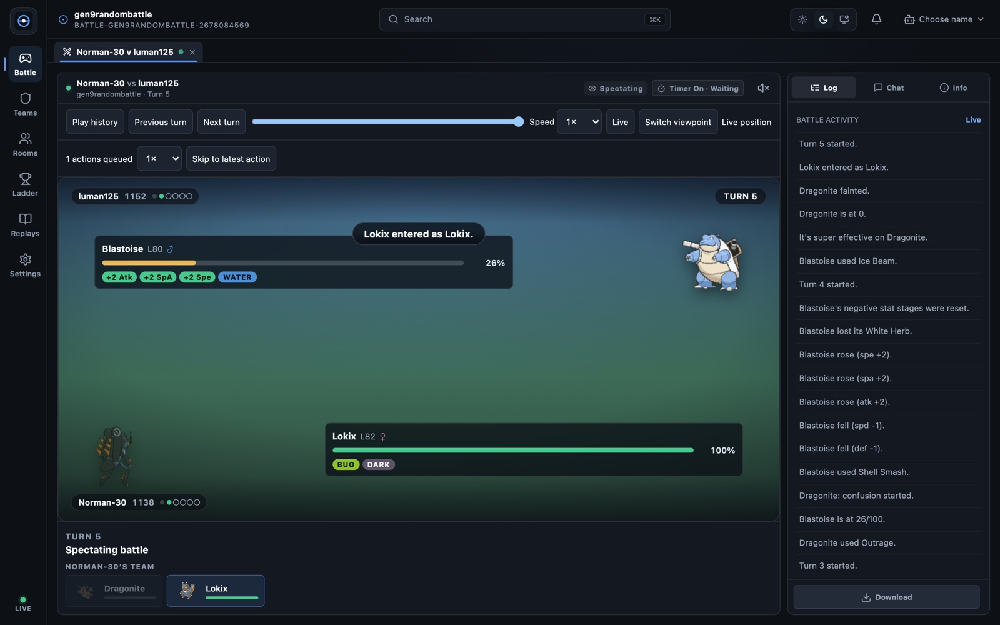

# Showdown Arena

An independent, open-source browser client for [Pokémon Showdown](https://pokemonshowdown.com/).

[](https://github.com/abhishekpradhan/pokemon-showdown-client/actions/workflows/ci.yml)
[](LICENSE)

**[Play](https://showdown-arena.vercel.app)** · [Docs](#documentation) · [Contributing](CONTRIBUTING.md)

## Why

- **A modern stack on the maintained engine.** React 19, TypeScript and Vite, with battle state derived by [`@pkmn/client`](https://github.com/pkmn/ps) instead of a hand-written protocol layer.
- **Built for phones as well as desktops.** Responsive layouts, touch-sized controls, and an installable PWA whose team editor keeps working offline.
- **Never sees your password.** Registered accounts sign in through Pokémon Showdown's own OAuth page; guest names need no account at all.
- **A client, nothing more.** It connects to real Pokémon Showdown servers and runs no game server of its own.

## What works

- **Matchmaking and challenges** for the formats the server advertises and the client can play, with team selection and server-side validation.
- **Battles** in singles, doubles, triples, multi and free-for-all: targeting, team preview, forced switches, Z/Max and other request-driven mechanics, timers, and tooltips for moves and combatants.
- **Spectating** from any player's viewpoint, including joining mid-battle.
- **Team builder** with a generation-aware set editor, packed/text import and export, backups, folders and search, official sample sets with preview and undo, and EV/nature suggestions.
- **Chat rooms, private messages and user cards**, including room polls and intros, rosters, ignore lists and safe interactive room content.
- **Tournaments** (signups, challenges, brackets), the **ladder**, and a live-battle directory.
- **Replays** loaded from a URL or pasted log, with turn-by-turn playback, saving and sharing.
- **Personalisation**: trainer avatars, twelve server languages, backgrounds (built in or your own image), separate sound levels with optional battle music, desktop notifications, light and dark themes, and reduced motion.
- **Browsers**: current Chrome/Edge, Firefox and Safari, plus Android Chrome and iOS Safari.

Limits: rotation battles are not supported ([#14](https://github.com/abhishekpradhan/pokemon-showdown-client/issues/14)); registered sign-in needs an OAuth client ID registered for each origin, while guest names work everywhere; the interface is English (the language preference translates server messages); and the project is not affiliated with Smogon or Nintendo. The full support matrix is in [docs/compatibility.md](docs/compatibility.md).



## Quick start

Node 24 (recorded in `.nvmrc`) or Node 22.13+.

```sh
nvm use
npm ci
npm run dev
```

Open [localhost:5173](http://localhost:5173). The client connects to `sim3.psim.us` by default, and guest names work straight away. Registered accounts need an OAuth client ID registered to your exact origin; [docs/self-hosting.md](docs/self-hosting.md) explains how to get one. Copy `.env.example` to `.env.local` to change servers or endpoints.

## Commands

| Command                            | What it does                                                                 |
| ---------------------------------- | ---------------------------------------------------------------------------- |
| `npm run dev`                      | Development server with the production API handlers on :5173                 |
| `npm run check`                    | Typecheck, lint, Prettier check and unit tests                               |
| `npm run build`                    | Production build with offline manifest, license inventory and bundle budgets |
| `npm run preview`                  | Serve the built app with production headers and API handlers on :4173        |
| `npm run test:e2e`                 | Browser flows and accessibility (`-- --project=chromium` for one browser)    |
| `npm run test:visual`              | Desktop and mobile screenshot baselines (maintained on macOS)                |
| `npm run test:production`          | Built-app checks for headers, API boundaries, PWA and offline; build first   |
| `npm run test:integration`         | Battles, reconnects and tournaments against a pinned local Showdown server   |
| `LIVE_PS_TESTS=1 npm run test:live` | Opt-in guest handshake against a real server                                 |
| `npm run format`                   | Format the codebase with Prettier                                            |

Browser tests need `npx playwright install chromium firefox webkit` once. [docs/testing.md](docs/testing.md) describes each tier.

## Privacy and connections

Battles and chat travel over a WebSocket straight from your browser to the battle server you choose. Guest names are signed through the same-origin `/api/action` proxy, and registered accounts authorise on Pokémon Showdown's OAuth page, so the client never handles a password. Modern servers save replays themselves; older ones upload through `/api/replay` to the configured login server. Sprites, sounds, ladder data, replays and sample sets are fetched from their configured hosts, and there is no analytics. Teams, preferences, your server choice and the OAuth token stay in this browser. Details are in [docs/privacy.md](docs/privacy.md).

## Deploy

[docs/self-hosting.md](docs/self-hosting.md) covers Vercel and other hosts, endpoint configuration and per-origin OAuth registration. [docs/releases.md](docs/releases.md) describes how releases are cut, verified and rolled back. Every production build ships `/build-info.json`, `/third-party-licenses.json` and `/THIRD_PARTY_NOTICES.txt`.

## Status and roadmap

Version 1.2.0 covers the workflows listed above; the [changelog](CHANGELOG.md) records what each release changed. Work is planned in the [issue tracker](https://github.com/abhishekpradhan/pokemon-showdown-client/issues). Three items stay open by design:

- [#12](https://github.com/abhishekpradhan/pokemon-showdown-client/issues/12) — acceptance on physical phones and with screen readers.
- [#13](https://github.com/abhishekpradhan/pokemon-showdown-client/issues/13) — registered-account acceptance against the production login service.
- [#14](https://github.com/abhishekpradhan/pokemon-showdown-client/issues/14) — rotation battles, once the server offers a playable protocol.

## Contributing

Read [CONTRIBUTING.md](CONTRIBUTING.md) for setup, validation and style. Report bugs and request features through [GitHub issues](https://github.com/abhishekpradhan/pokemon-showdown-client/issues), report vulnerabilities privately as described in [SECURITY.md](SECURITY.md), and see [SUPPORT.md](SUPPORT.md) for how issues are triaged.

## Documentation

| Document                                      | Read it for                                                   |
| --------------------------------------------- | ------------------------------------------------------------- |
| [docs/compatibility.md](docs/compatibility.md) | What is supported, format by format, and what is not          |
| [docs/architecture.md](docs/architecture.md)   | How the code is organised and the design decisions behind it  |
| [docs/testing.md](docs/testing.md)             | Every test tier, protocol-change rules, the pinned server     |
| [docs/self-hosting.md](docs/self-hosting.md)   | Running your own deployment                                    |
| [docs/privacy.md](docs/privacy.md)             | Where data goes and what is stored                             |
| [docs/offline.md](docs/offline.md)             | What works offline, how updates apply, cache recovery          |
| [docs/releases.md](docs/releases.md)           | Release, verification and rollback process                     |
| [docs/attribution.md](docs/attribution.md)     | Licenses, upstream code, assets and source provenance          |

## License and attribution

Showdown Arena is licensed under [AGPL-3.0-or-later](LICENSE). Copyright (C) 2026 Abhishek Pradhan and contributors.

The project started as a fork of the [official Pokémon Showdown client](https://github.com/smogon/pokemon-showdown-client) by Guangcong Luo and contributors, but is an independent rewrite. The only upstream code retained is adapted from three MIT-licensed files, listed with their notices in [UPSTREAM_NOTICES.txt](UPSTREAM_NOTICES.txt). The AGPL's network-source requirement is met through the Source code link in Settings → About and `/build-info.json`, which names the exact revision that was built; self-hosted forks point `VITE_SOURCE_URL` at their own source. See [docs/attribution.md](docs/attribution.md) for dependency and asset origins.

Pokémon and Pokémon character names are trademarks of Nintendo. This project is not affiliated with or endorsed by Nintendo, Creatures, GAME FREAK, or Smogon.
