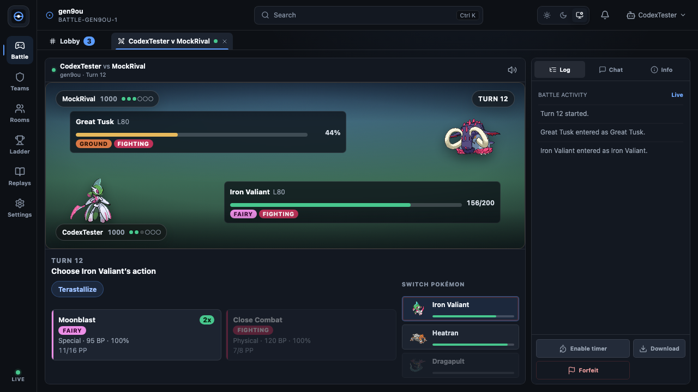

# Showdown Arena

[](https://github.com/abhishekpradhan/pokemon-showdown-client/actions/workflows/ci.yml)
[](LICENSE)

An independent browser client for [Pokémon Showdown](https://pokemonshowdown.com/), built with React, TypeScript, Vite and the maintained [`@pkmn/client`](https://github.com/pkmn/ps) battle engine.

**[Play Showdown Arena](https://showdown-arena.vercel.app)** · [Compatibility](docs/compatibility.md) · [Roadmap](docs/roadmap.md) · [Contribute](CONTRIBUTING.md)

Build and import teams, find or watch battles, chat and exchange private messages, inspect ladders, and review replay logs. Feature depth varies by format and workflow: the [compatibility map](docs/compatibility.md) records the support contract and verification needed before releases. This project is a client; it does not run a battle server or share a browser session with the official client.



## Start locally

Use **Node 22 LTS (22.13+) or Node 24 LTS**; Node 24 is recommended and recorded in `.nvmrc`. These are the tested supported lines. Node 26 is not currently supported.

```sh
nvm use
npm ci
npm run dev
```

Open [localhost:5173](http://localhost:5173). The default connection is `sim3.psim.us`. Guest names work without credentials. Registered accounts require an OAuth client ID registered to your exact origin; see [self-hosting](docs/self-hosting.md).

Copy `.env.example` to `.env.local` for local configuration. Variables beginning `VITE_` are public build inputs. Keep credentials out of them and never commit local environment files.

## Commands

| Command | Purpose |
| --- | --- |
| `npm run dev` | Development app and the production Request API handlers on :5173 |
| `npm run check` | Typecheck app, APIs and browser tests; lint; unit tests |
| `npm run build` | Production app, offline manifest, source/license inventory and bundle budgets |
| `npm run preview` | Serve the built app with production headers and API handlers on :4173 |
| `npm run test:e2e` | Browser flows and accessibility across configured browsers |
| `npm run test:visual` | Desktop/mobile screenshots on the maintained macOS baseline platform |
| `npm run test:production` | Built callback/header/API/PWA/offline regressions; run build first |
| `npm run check:licenses` | Check locked dependency license metadata against reviewed inventory |
| `npm run audit:dependencies` | Query current npm advisories; needs network access |
| `LIVE_PS_TESTS=1 npm run test:live` | Opt-in guest handshake check against a real server |

For browser tests, first run `npx playwright install chromium firefox webkit` (Linux CI also uses `--with-deps`). See [CONTRIBUTING.md](CONTRIBUTING.md) for the same validation paths CI runs.

## Connections and privacy

Battles and chat use a direct browser WebSocket. Guest assertions use the same-origin `/api/action` proxy. Registered login opens Pokémon Showdown's OAuth page; the client does not collect passwords. Modern servers save replays themselves; legacy uploads use `/api/replay` to the configured login service. Ladder, replay downloads, sprites, audio and room images may contact additional hosts. Teams, preferences and the OAuth session token are stored in this browser. [Privacy and storage details](docs/privacy.md).

Development and preview use the same API handler functions as deployment through a Node adapter. Vercel deploys those handlers in its Edge runtime; release checks must also verify the deployed boundary.

Once the service worker finishes installing, the local team editor, bundled game data and app resources are available offline. Live battles, remote content, login and uploads need connectivity. Updates wait for approval or all older tabs to close; finish live games before applying one. [Offline contract and recovery](docs/offline.md).

## Deploy and maintain

[Self-hosting](docs/self-hosting.md) covers Vercel and other hosts, endpoint configuration and origin-specific OAuth. [Release checklist](docs/releases.md) covers source revision, compatibility evidence, storage migration and rollback. Each production build includes `/build-info.json`, `/third-party-licenses.json` and `/THIRD_PARTY_NOTICES.txt`.

Use [GitHub issues](https://github.com/abhishekpradhan/pokemon-showdown-client/issues) for bugs and feature requests. Report vulnerabilities privately using [SECURITY.md](SECURITY.md). [SUPPORT.md](SUPPORT.md) explains triage and maintainer contact paths.

## License and attribution

AGPL-3.0-or-later — [LICENSE](LICENSE). This project began as a fork of the [official Pokémon Showdown client](https://github.com/smogon/pokemon-showdown-client), by Guangcong Luo and contributors. Preserve the applicable source and copyright notices when distributing changes. [Attribution and dependency/asset origins](docs/attribution.md).

Pokémon and Pokémon character names are trademarks of Nintendo. This project is not affiliated with or endorsed by Nintendo, Creatures, GAME FREAK, or Smogon.
